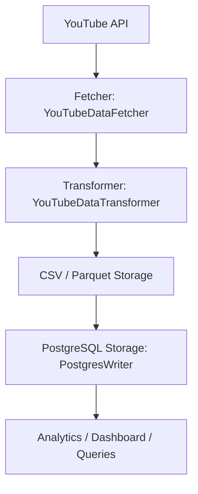

# YouTube Trending Data ETL Pipeline

**Author:** Junaid Iqbal shah  
**Tech Stack:** Python, Airflow, Pandas, SQLAlchemy, PostgreSQL, Parquet, YouTube Data API  
**Project Type:** ETL / Data Engineering Project  

---

## Project Overview

This project is a **scalable ETL pipeline** built with **Apache Airflow** that extracts trending videos data from the **YouTube Data API**, transforms the data, stores it in **CSV/Parquet**, and finally loads it into a **PostgreSQL database**.  

It demonstrates **best practices in data engineering**, including:

- Modular and reusable code using **Single Responsibility Principle (SRP)**.  
- Efficient handling of **large datasets (1TB+)** using **streaming, batching, and Parquet format**.  
- Production-ready Airflow DAGs with logging, retries, and proper error handling.  
- PostgreSQL integration using **SQLAlchemy ORM** with batch inserts.  

---

## Project Architecture

## Modules Breakdown

| Module                         | Responsibility                                                   |
| ------------------------------ | ---------------------------------------------------------------- |
| `fetcher/`                     | Fetch trending data from YouTube API                             |
| `transformer/`                 | Clean and transform raw API data (e.g., compute engagement rate) |
| `storage/csv_storage.py`       | Store records in CSV                                             |
| `storage/parquet_storage.py`   | Store records in Parquet for large-scale data                    |
| `storage/psql_writer.py`       | Batch insert records into PostgreSQL                             |
| `utils/logger.py`              | Centralized logging for Airflow tasks                            |
| `utils/db.py`                  | SQLAlchemy PostgreSQL session & table initialization             |
| `dags/youtube_trending_dag.py` | Orchestration DAG connecting all tasks                           |

## Features

- **Modular Design**: Each component handles a single responsibility for easier maintenance and testing.  
- **Scalable Storage**: Uses Parquet with Snappy compression for efficient disk storage and fast read/write.  
- **Batch Inserts**: PostgreSQL inserts handled in batches (configurable) to optimize performance.  
- **Logging**: All DAGs include detailed logging for monitoring and debugging.  
- **Airflow Ready**: Fully schedulable DAGs with retries, failure alerts, and clean task separation.  
- **Engagement Rate Calculation**: Computes likes/views ratio for each video on-the-fly.  

